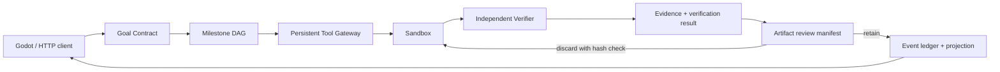

# Architecture

The v2 path is Goal Contract → DAG planner → Gateway → Verifier → Evidence → events/checkpoint/recovery. The event ledger is the only write path for state transitions. Gateway allowlists tools and confines paths to the Quest sandbox; Verifier checks current artifacts and acceptance criteria rather than trusting agent text.

Action receipts move through `prepared → dispatched → committed/failed/unknown_effect`. Idempotency keys prevent a repeated request from silently changing parameters; an ambiguous write is reconciled against the current artifact or paused for a human decision. Completed DAG nodes and their evidence are immutable across constrained replans.

WebSocket streams are at-least-once. Consumers deduplicate by `(quest_id, sequence)` and reconcile from persisted traces after reconnect; this is not an exactly-once guarantee. SQLite, one process and one node define the release boundary. `/api/v1` remains a compatibility surface.

Artifact review is opt-in for backward compatibility. A review Quest always owns
an automatically generated workspace. Final verification freezes a manifest of
previewable UTF-8 files and moves the Quest to `waiting_user`; it is completed
only after an idempotent retain decision. Discard records a durable intent,
deletes only manifest files whose current hash still matches, and reconciles an
interrupted deletion on startup. Evidence remains immutable historical proof;
artifact disposition describes whether its file was retained or discarded.

## Migration 7 compatibility-shadow artifact provenance

Migration 7 closes the observation gap without changing completion semantics.
After `ExecutionAdmitted` and before the first tool action, the runtime records a
bounded, symlink-safe workspace baseline. A successful `write_file` atomically
binds its real before/after SHA-256 observation to the action receipt and
`ToolCommitted` event. At artifact-review time, the final snapshot, provenance
rows, frozen manifest and `ArtifactReviewRequested` event are committed in one
SQLite transaction.

This ledger is deliberately a compatibility shadow. Its database states are
only `shadow`, `legacy_unobserved` and `unrecoverable`; it cannot claim
`verified`. Historical executions that already contain actions receive an empty
`legacy_unobserved` marker rather than a fabricated baseline. Replay consumes
persisted records and performs no filesystem scan or tool call. Godot displays
the fine-grained status as a read-only audit hint, but it does not change
retain/discard buttons or replace Verifier/Evidence. See
[`adr-0001-artifact-shadow-provenance.md`](adr-0001-artifact-shadow-provenance.md).

## Phase 1A model-call foundation (not wired into the runtime)

The v2 Phase 1A foundation is deliberately outside the production Planner path.
It provides strict provider-neutral request/response contracts, an offline
deterministic fake, and a coordinator that records and validates planning
candidates without adopting or executing them. Migration 5 adds independent
model-call/attempt audit records and atomic Token reservations; it does not
append Quest events or mutate contracts, plans, projections or checkpoints.
`validated_current` means the bound Quest snapshot is still current, not that a
candidate was adopted. See [`v2-phase-1a.md`](v2-phase-1a.md) for recovery,
privacy, rollback and Phase 1B gates.

## Phase 2A deterministic RAG foundation (not wired into the runtime)

`backend/app/v1/rag.py` is a provider-free, in-memory lexical retrieval module.
It receives explicit documents rather than paths or database records; it has no
file-system, network, model, Event, Evidence, Gateway or Quest dependency.
Canonical NFC text, document/index/chunk hashes, bounded chunking, integer
scores and a fixed tie break make the index and ranking repeatable.

A retrieval result carries the schema/index/query/requested-top-k,
retriever/ranker versions, ordered hits and citations in a tamper-evident
`bundle_hash`. Citations are independently recomputed from the immutable index
and query. This data is untrusted context, never Evidence or authority.
`benchmark/rag_evaluation/` evaluates a synthetic multilingual/adversarial
dataset into sandbox-only artifacts with zero provider and embedding calls.

P2A has no migration and does not participate in Quest replay or recovery. A
future Quest-bound retrieval audit requires a separately designed additive
migration 8 or later and must replay the saved bundle rather than re-run
retrieval. See
[`v2-phase-2.md`](v2-phase-2.md) for the security boundary, metrics, credential
operation and P2B gates.

## P3A local stdio MCP Gateway Adapter (fixture-only)

P3A is a default-off adapter at the Gateway boundary, not a second execution
plane. `create_app` requires both `enable_local_mcp=true` and explicit injected
fixed `local_mcp_servers`; a missing injected configuration rejects startup.
For each binding it runs the fixed local stdio fixture through the MCP
2025-06-18 initialize/tools-list lifecycle, hashes the full descriptor/schema,
and installs only the corresponding static `mcpv1_*_<binding-hash>` tool.
Discovery does not grant authority: descriptor/schema drift, collisions and
unbound tools are rejected before Gateway registration.

Each discovery and call owns a short-lived process with fixed absolute
executable/argv/cwd, minimal environment, timeout and stdout/stderr caps. The
bound tool still passes through the existing Gateway allowlist, idempotency
key, receipt and `unknown_effect` handling; mutable bindings are
high-risk and need the existing approval flow. MCP output is untrusted tool
data, never Evidence. Shutdown cancels known sessions and replay makes zero MCP
calls. P3A adds no API, database or migration and does not claim real-server,
remote MCP/OAuth, network-sandbox or production-security acceptance. See
[`v2-phase-3.md`](v2-phase-3.md).

The existing Quest path `Sandbox` is not an OS sandbox for arbitrary child
processes. P3A therefore permits only the trusted repository fixture; a real
server remains blocked on a separately approved process/filesystem/network
containment design.

## Local model-settings control plane (separate post-P2A increment)

The ignored local development/test file uses schema v3 and stores a same-source
provider triple: `base_url`, `api_key`, and `model`. OpenAI remains restricted
to its approved `/v1` endpoint/model combination. Native Qwen is restricted to
`qwen-plus` and an HTTPS Beijing DashScope workspace base URL ending in
`/api/v1`; the adapter alone appends the fixed generation endpoint. Environment
configuration is also a complete same-source triple for the selected provider.
Partial values, source mixing, arbitrary hosts/models and default fallback are
rejected.

The Godot Quest-console Settings panel is a default-off local control plane,
not a provider client and not a Quest/RAG integration. It is present only for
development/test with `local_file`, an explicit
`PROJECTTOWN_ENABLE_LOCAL_SETTINGS_CONTROL=1`, and non-Docker registration.
Its GET response is redacted; its PUT is write-only (`keep`/`replace`/`clear`),
revision-CAS protected and atomically ACL-written. A short-lived session token
is sent by Godot only to strict loopback HTTP origins with an explicit valid
port. Production and Docker omit the route. The panel exposes OpenAI and Qwen;
Qwen is configurable but labelled as awaiting live authorization, while
DeepSeek remains unavailable. Opening or saving it never makes a provider
request. Qwen is isolated to its adapter and default-off evaluation runner, is
not Quest/RAG wired, and has only offline/Mock acceptance. A replacement key
must be rotated and entered by the user directly in the local panel; it must
not be placed in documentation or source. Final live acceptance remains
separate from P2A RAG acceptance.

For a strictly local Docker development instance only,
`docker-compose.local-settings.yml` is an explicit opt-in override. It retains
the base loopback port, read-only root filesystem, UID, dropped capabilities and
no-new-privileges setting, while mounting a dedicated Docker named volume at
`/app/.secrets`. Provider configuration never leaves that volume; the host
receives only a verified session-token mirror. It supplies all five gates: control enabled,
development/test profile, `local_file`, container opt-in, and one canonical
IPv4 trusted peer. The override fixes the bridge to `172.30.250.0/29` with host
gateway `172.30.250.1`; the application accepts only that exact peer and keeps
the strict loopback Host plus no Origin/Cookie/query and constant-time token
checks. It does not trust `X-Forwarded-For` or `Forwarded`. A Linux container
holds an exclusive nonblocking lock for its lifetime; a correctly protected
stale token is atomically rotated after the lock, while invalid token/path/
permission state fails closed. Base Compose has no secret mount and retains 404.
