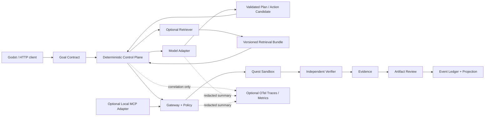

# ProjectTown v2.0 项目开发文档

> 文档状态：设计基线 / 待按阶段实施  
> 编制日期：2026-08-13  
> 适用仓库：ProjectTown 仓库根目录  
> 当前交付边界：Windows / Python 3.12 / Godot 4.7.1 / Docker Desktop / 单节点单进程 SQLite

## 1. 文档目的

本文以当前代码、`docs/v2-handoff.md`、`docs/validation-v1.0.md`、`docs/architecture.md`、
`docs/limitations.md` 和 11 份 Agent 项目岗位简历样本为输入，回答四个问题：

1. 当前 Agent 实习项目常见的技术栈、亮点和共性缺陷是什么；
2. ProjectTown 是否存在技术性不足，真正的技术优势在哪里；
3. v2.0 应补齐哪些功能与技术栈，哪些技术不应为了“看起来丰富”而引入；
4. 如何在不破坏 v1 不变量的前提下，形成可实施、可测试、可回滚的开发路线。

本文只定义设计与开发计划，不授权选择许可证、公开发布、使用付费模型、上传用户数据、
部署公网服务或迁移到多节点架构。

## 2. 结论摘要

### 2.1 当前项目是否技术性不足

结论：**不是技术深度不足，而是技术能力分布与招聘样本不同。**

多数样本把技术亮点放在 LangChain/LangGraph、真实模型 API、RAG、向量库、MCP、Redis、
流式输出和多 Agent 编排上。ProjectTown 当前缺少这些容易被招聘方快速识别的 AI 应用层标签，
但已经具备样本中少见且更难正确实现的运行时能力：

- Goal Contract 两阶段确认；
- append-only Event ledger、状态版本 CAS、Checkpoint、Replay 和启动恢复；
- Gateway allowlist、Sandbox、幂等键、原子回执和模糊副作用协调；
- 独立 Verifier/Evidence，不信任 Agent 自报完成；
- Watchdog、预算和受限重规划；
- 成果哈希冻结、预览以及显式保留/丢弃；
- WebSocket at-least-once 传输和 `(quest_id, sequence)` 去重；
- deterministic runtime simulation 与真实模型结果的明确边界。

因此 v2.0 不应重写现有 runtime，也不应以堆叠框架作为目标。正确方向是：

> 保留“可审计、可恢复、安全受控”的 Agent runtime，补齐一个 provider-neutral 的真实模型闭环、
> 可验证的模型/RAG 评测、必要的可观测性和完整的历史任务产品体验；随后再有条件加入 RAG 与 MCP。

### 2.2 v2.0 的优先级

| 优先级 | 方向 | 结论 |
|---|---|---|
| P0 | 固化当前 v1/v2 基线与发布卫生 | 必须持续执行；许可证、Git/tag 仍由用户决定 |
| P1 | Provider-neutral Model Adapter 与真实模型评测 | v2 核心，先 fake、后单一真实 provider |
| P1 | Prompt/模型参数/Token/成本/延迟审计与密钥隔离 | 与 Model Adapter 同期完成 |
| P1 | Quest 历史产品化 | 后端与 Godot 的搜索/状态筛选/分页已完成；归档和失败导航待完成 |
| P1 | OpenTelemetry-compatible 可观测性 | 可选启用，不能成为状态真相 |
| P2 | 确定性 RAG 契约、provenance 和离线评测 | **P2A 已于 2026-08-21 由 Sol 验收**：离线 lexical/citation/bundle 与合成评测；Quest 绑定 RAG provenance 仍为 P2B，须使用 migration 8 或更高版本 |
| P2 | 确定性 Godot 截图回归 | 已有固定 fixture/golden/pixel-diff 基线；CI 与跨平台策略仍待完成 |
| P3 | 本地 MCP Gateway Adapter | **P3A fixture-only local stdio adapter 已通过 Sol 验收；P3B 真实 server 激活仍需用户决策**，不得形成第二执行平面 |
| 独立阶段 | 认证、多用户、PostgreSQL、队列、多节点 | 不属于 v2 核心，需单独架构与迁移方案 |

## 3. 2026-08-13 当前基线复验

本节记录本轮重新执行或直接核验的证据，不沿用旧会话的“通过”结论。详细的 v1 历史验收仍见
`docs/validation-v1.0.md`；下列结果只说明 2026-08-13 当前 checkout 和本机环境。

| 检查 | 本轮实际结果 | 可追溯证据 |
|---|---|---|
| Git | 根目录没有 `.git`，不能给出 commit、branch、dirty 状态或 tag | 根目录 `Test-Path .git` |
| 根许可证 | 未发现 `LICENSE`/`LICENSE.md`/`LICENSE.txt`/`COPYING*` | 根目录许可证文件检查；第三方字体声明不等于项目根许可证 |
| Docker | Docker client/server 29.7.2，Compose 5.3.1；`docker compose config --quiet` 退出码 0；容器 `healthy`，仅映射 `127.0.0.1:8000` | `docker compose ps`、container health inspect、`docker-compose.yml` |
| 数据库备份 | 在线备份位于 `sandbox/tmp/v2-baseline-db-backup-20260813/projecttown.db`，大小 1,445,888 bytes | 备份文件与同目录 WAL/SHM |
| SQLite | 备份库和当前 Docker 库均为 `integrity_check=ok`、`foreign_key_check=[]` | 对两份数据库执行 SQLite PRAGMA |
| Migration | 当前库安装且代码只定义 migration 1–4；库中四个 checksum 与安装逻辑一致 | `v1_schema_migrations` 与 `backend/app/v1/storage.py` |
| Ruff | 退出码 0，`All checks passed!` | `python -m ruff check backend tests scripts` |
| compileall | 退出码 0 | `python -m compileall -q backend scripts` |
| pip check | 退出码 0，`No broken requirements found.` | `python -m pip check` |
| 默认 Pytest | 退出码 0，`99 passed, 1 warning` | `sandbox/tmp/v2-doc-revalidation-default-20260813/` |
| 覆盖率门禁 | 退出码 0，`99 passed, 1 warning`，总覆盖率 87.93%，通过 80% 门槛 | `sandbox/tmp/v2-doc-revalidation-coverage-20260813/` 与 `.coverage` |
| Docker health | `/health` 返回 `status=ok`、`version=1.0.0`、`database=ok`；`/api/v2/health` 无中断 Quest、模糊 action 或孤立 committed action | 当前 loopback 容器接口 |
| Godot | Godot 4.7.1；editor/main/time/API/restore 均退出 0；`TIME_CYCLE_SMOKE_OK anchors=6 midpoints=3` | `sandbox/tmp/v2-godot-baseline-20260813/` |
| Godot live/recovery | live Quest `completed`，20 events/4 evidence；恢复 Quest 18 events/4 evidence/1 artifact | 同一 Godot 复验目录日志 |
| Godot 源文件保护 | 排除 `.godot` 后 70 个源文件的前后 SHA-256 清单一致，stderr 总字节数为 0 | 同一目录 `source-before/after.sha256.csv` |
| formal-v1.0 Benchmark | manifest 是 `runtime_simulation=true`、seed 1729、4,320 rows；四个受管产物实际 SHA-256 均与 manifest 一致 | `benchmark/results/formal-v1.0/manifest.json` 与 `Get-FileHash` |

本轮唯一测试警告仍来自 FastAPI/Starlette TestClient 的第三方 httpx 适配弃用提示。以上复验没有
选择许可证、初始化 Git、创建 tag、公开发布、调用付费模型或改变 Docker 数据。
本节保存了命令、退出状态和关键摘要，但没有将每条命令的完整 stdout/stderr 作为仓库产物提交；
后续阶段应生成带时间、命令、退出码、环境和产物哈希的机器可读 validation manifest。

## 4. 简历样本分析说明

### 4.1 证据边界

- 样本按 S1–S11 编号，不记录或复述姓名、电话、邮箱和照片等身份信息。
- 技术栈与项目描述仅来自图片可见文本。
- 所有准确率、召回率、并发量、延迟和性能提升均为候选人自述，未检查仓库、日志、
  评测集、硬件环境或提交记录，不能视为已验证事实。
- S3、S6、S9 的图片分辨率较低，只采用可可靠辨识的信息。
- 评价对象是项目描述呈现的工程信号，不是对候选人个人能力的最终评价。

### 4.2 逐份样本技术栈及优缺点

| 样本 | Agent 项目与技术栈 | 优点/工程信号 | 缺点/待核验项 |
|---|---|---|---|
| S1 | 工业质检 Agent、金融多 Agent；Python、FastAPI、LangChain、LangGraph、Vue 3、TypeScript、ChromaDB、MySQL、DashScope Embedding、Tavily、BaoStock | ReAct、StateGraph、DAG、多角色协作、RAG、SSE、会话/Token 管理、鉴权和审计描述较完整 | 缺评测集、工具异常/恢复、部署和测试证据；系统规模与个人贡献边界需核验 |
| S2 | 多 Agent 旅行规划；LangChain、LangGraph、FastAPI、Pydantic、MCP；另有 Spring Boot、OpenGauss、Redis、JWT、Docker | 场景边界清晰；并行工具、状态管理、StructuredTool 和类型校验具有应用层可实施性 | 未描述路由失败、记忆、恢复、数据来源和 Agent 评测；量化提升缺基线与压测口径 |
| S3 | nanobot 多 Agent 助手；Python、FastAPI、MCP、Skills、LangChain/LangGraph、SQLite、Gradio、Tavily | 可辨识 Planner/Worker/Summary、Trace、MCP Skills、RAG/网页检索等完整概念 | 小字不可完全辨识；关键词密度高于可验证实现细节，需现场解释状态转移和异常路径 |
| S4 | 法律咨询、多平台运营、RAG 文档问答；FastAPI、LangGraph、ChromaDB、PostgreSQL、Ollama、Coze、OSS、Ragas、Docker、BM25+Vector+Reranker、OCR | 检索、重排、元数据过滤、Checkpoint、文件解析、部署和评测链路较完整 | 法律高风险场景缺引用/拒答/法规版本/人工复核设计；召回率提升声明缺数据集与定义 |
| S5 | Coding Agent CLI、模块化 RAG MCP Server；Anthropic/OpenAI API、ReAct、Function Calling、SSE、AsyncIO、MCP、ChromaDB、BM25、RRF、Reranker、Ragas、pytest | 工具读写保护、deny-first/fail-closed、上下文压缩、Sub-Agent、手写协议、Golden Set 和 Trace 是最强 Agent 工程信号 | 覆盖面很广但缺可运行证据；威胁模型、沙箱隔离和评测结果仍需代码走读验证 |
| S6 | Java 代码审查 Agent；LangChain4j、LangGraph4j、RAG、Redis、MySQL、FastAPI/JWT、Spring Boot、Docker、Vue 3 | JVM Agent 生态相对稀缺；具备会话、混合检索、接口和多 Agent 后端信号 | 图片低清；测试、恢复、权限、评测和个人职责不够清楚 |
| S7 | VLM 异常检测与图像伪造分析；PyTorch、ViT、VideoMAE、LoRA、Qwen、KMeans、One-Class SVM、ResNet34-UNet；技能栏提及 FAISS/RAG | 强模型训练、视觉数据处理、微调与传统算法组合经验 | 没有 Agent/RAG 项目闭环；缺工具调用、服务化、检索评测和权限治理，不应强行归为 Agent 项目 |
| S8 | 法规/诉讼分析、合同管理、招投标问答；Spring Boot、Redis、MySQL、FastAPI、SSE、LangChain、Ollama、Chroma、MCP、Docker | Java/Python 后端、LLM 接入、缓存、文档格式、状态机和流式响应组合较完整 | 缺 citation、检索评测、提示注入防护、工具安全、可观测性和失败降级 |
| S9 | 智能问答 Agent；可辨识 Spring Boot、WebSocket、Elasticsearch、Kafka、Redis、MinIO、MySQL、DeepSeek API、RAG、ReAct、Multi-Agent、MCP | 技术覆盖面广，可能包含文档、异步消息、存储、缓存和 Agent 工作流 | 图片低清且关键词堆叠明显；模块边界、职责、指标和真实实现均需先看高分辨率原件或仓库 |
| S10 | 高性能 HNSW 向量检索引擎；C++20、OpenMP、CMake、SIMD、shared_mutex、atomic/CAS、AVX2/FMA | 强系统工程、ANN、并发正确性、性能剖析和 benchmark 信号；对 RAG 基础设施有价值 | 不是完整 Agent 项目；没有文档摄取、LLM 编排、工具或评测闭环；性能数据需硬件与脚本复现 |
| S11 | 智能对话 Agent、LLM 数据分析；Python、FastAPI/Django、LangChain、MySQL、Redis、JWT、SSE、Chroma、BM25、HyDE、Rerank、ReAct、SQL Agent | 混合检索、查询改写、重排、流式交互、缓存、ETL 和 SQL Agent 链路相对完整 | 缺 SQL 安全、数据权限、citation、评测集、观测与降级；大量指标口径不清 |

### 4.3 样本中的高频技术能力

以下频次表示“图片中明确出现”，不表示熟练或已实现：

| 能力类别 | 样本观察 | 对岗位的意义 |
|---|---|---|
| Python + FastAPI | 多数可归类为 Agent 应用的样本出现 | AI 应用后端基础门槛 |
| LangChain/LangGraph/ReAct | 高频 | 模型工具调用与工作流编排的显性标签 |
| RAG | 高频 | 文档/知识密集 Agent 的常见业务闭环 |
| 向量/混合检索 | Chroma、FAISS、Elasticsearch、HNSW、BM25、RRF、Rerank | 区分“简单向量查询”和完整检索工程 |
| MCP | 多份出现 | 工具生态互操作的热门信号，但安全实现经常缺失 |
| Redis/MySQL/PostgreSQL | 高频 | 会话、缓存、业务数据和部署工程能力 |
| SSE/WebSocket | 多份出现 | 流式交互与长任务状态反馈 |
| Docker | 高频 | 最低限度的可交付性信号 |
| Ragas/Golden Set/Trace | 少数样本出现 | 比单纯“接入模型”更有价值的评测与可观测性信号 |
| 工具权限/上下文压缩/幂等恢复 | 极少出现 | Agent runtime 与普通 AI Demo 的核心分界 |

### 4.4 样本的共同优点

- 场景覆盖广：法律、金融、旅行、工业、代码、数据分析和企业知识问答；
- 普遍能把 LLM 接入 Web 后端，并提供流式交互；
- 较强样本开始关注混合检索、重排、MCP、评测和部署；
- 个别样本体现了工具安全、上下文压缩、协议实现或 ANN 性能工程能力。

### 4.5 样本的共同缺陷

- 使用大量技术名词，但缺少状态机、数据流、失败窗口和模块所有权说明；
- 量化指标缺基线、样本量、硬件、P95/P99、失败率和可复现命令；
- RAG 常缺语料版本、chunk 策略、embedding/reranker 版本、citation 和错误集；
- Agent 常缺超时、取消、重试、幂等、响应丢失、重启恢复和迟到响应处理；
- 工具安全常停留在“鉴权”，缺 allowlist、路径边界、审批、回执和模糊副作用协调；
- 很少区分模型自报结果与独立验证结果；
- 很少说明 Prompt、模型参数、Token、成本、延迟和真实模型评测的版本关系；
- 多 Agent 经常只是角色数量增加，缺少证明其优于单 Agent 的消融实验。

这些缺陷正是 ProjectTown 当前 runtime 的差异化优势，v2.0 应展示并扩展这种优势，而不是放弃它。

## 5. ProjectTown 当前技术审查

### 5.1 当前定位

ProjectTown 是一个本地、单用户、单进程、单节点的可观察 Quest runtime。当前确定性路径为：

```text
Goal Contract
  -> DAG Plan
  -> Gateway / Sandbox
  -> Independent Verifier
  -> Evidence
  -> Artifact Review
  -> Event ledger / Checkpoint / Recovery
```

Godot 像素小镇是可视化控制台，不是项目的技术核心；技术核心是状态、外部副作用和验收证据的治理。

### 5.2 当前技术栈

| 层 | 当前技术 | 用途与边界 |
|---|---|---|
| 语言/运行时 | Python 3.12 | 后端、runtime、验证脚本与 Benchmark |
| Web/API | FastAPI、Uvicorn、Pydantic v2、HTTPX | REST/WebSocket、schema、测试客户端；HTTPX 承载隔离的 OpenAI/Qwen adapter，不把 provider SDK 接入 Quest runtime |
| Agent 控制面 | 自研 Goal Contract、DAG、Event ledger、CAS、Gateway、Verifier、Evidence、Watchdog | 唯一状态/权限/副作用控制面，不依赖 LangChain/LangGraph |
| 持久化 | SQLite、WAL、自定义版本化 migration 1–4、RLock | 本地单节点/单进程，非共享多节点数据库 |
| 工具执行 | Python 工具注册表、allowlist、Quest Sandbox、幂等 receipt | 当前只允许受控的文件读取、写入、列举和确定性检查 |
| 实时传输 | FastAPI WebSocket + REST 对账 | ordered at-least-once，客户端按 Quest/sequence 去重 |
| 客户端 | Godot 4.7.1、GDScript、GL Compatibility renderer | 像素小镇可视化、Quest 控制、事件/Evidence/成果审核与恢复 |
| 测试质量 | Pytest、pytest-asyncio、pytest-cov、Ruff、compileall、pip check | 99 项当前测试、80% 覆盖率门禁、契约/故障/恢复测试 |
| 评测 | 自研 deterministic benchmark、RAG 离线评测、独立 real-model runner、JSON/CSV/Markdown/SVG manifest | simulation、确定性 RAG 与真实模型评测分目录分标签；Qwen real-model runner 尚未 live 验收 |
| 交付 | Dockerfile、Docker Compose、GitHub Actions workflow 配置 | loopback 本地容器；只读根文件系统、非 root、cap drop；未证明远端 CI 已执行，暂无 CD/release |

### 5.3 当前应用场景

当前版本适合以下范围：

- 本地个人开发者把模糊目标整理成经确认、可执行、可回放的 Quest；
- 生成并验证受限的 Markdown 项目简报、README 和最小 Python CLI；
- 演示长任务状态机、人工决策、安全工具调用、崩溃恢复和成果审核；
- 作为 Agent runtime 可靠性、故障注入、证据治理和人机协作的教学/作品集平台；
- 为后续真实模型、RAG 或 MCP 接入提供确定性安全控制面。

当前不适合直接用于：开放式通用 Coding Agent、企业知识库问答、联网研究、生产自动化、
公网多人 SaaS 或多节点 worker 集群。原因不是 UI 不足，而是尚无真实模型、知识库、开放工具、
认证/租户和分布式一致性设计。

### 5.4 已具备的技术优势

| 能力 | 当前实现价值 | 相较样本的差异化 |
|---|---|---|
| Goal Contract | 用户先确认目标、约束、非目标、预算和验收条件 | 避免 Agent 直接执行含糊需求 |
| Event ledger + CAS | 所有状态变化可追踪，冲突可拒绝 | 比仅使用 LangGraph state 更强调持久一致性 |
| Replay/Checkpoint/Recovery | 重启后恢复并可核对状态 | 大多数简历只写“记忆/Checkpoint”，未写崩溃窗口 |
| Gateway + Sandbox | 工具 allowlist、路径限制、高风险审批 | 超越普通 Function Calling |
| Idempotency + Receipt | 防止重复写入并记录真实副作用状态 | 对长任务和网络故障尤其关键 |
| `unknown_effect` 协调 | 响应丢失时不盲目重试写操作 | 样本中几乎没有同类明确设计 |
| Verifier/Evidence | 从当前文件重新验证，不信任 Agent 文本 | 解决“模型声称完成”的根本缺陷 |
| Artifact Review | 哈希冻结预览，用户显式保留或丢弃 | 提供真正的人机成果闭环 |
| Watchdog/Budget/Replan | 限制循环、消耗和计划修改范围 | 比无限 ReAct 循环更可靠 |
| Deterministic Benchmark | 可重复故障矩阵和消融 | 已明确不冒充真实模型效果 |

### 5.5 当前技术性不足

这里的“不足”指相对于 Agent 应用岗位和 v2 产品目标的缺口，不否定现有 runtime 深度。

| 维度 | 当前状态 | 缺口等级 |
|---|---|---:|
| 真实模型 Adapter | OpenAI Responses 与 native DashScope Qwen adapter 已隔离实现；Qwen 固定 `qwen-plus`，均未接入 Quest Planner | 中：live/provider 实测与候选采纳协议仍缺 |
| Structured Model Output | 有结构化目标摘要、固定 Prompt registry 与 fail-closed 输出校验 | 中：真实模型输出质量尚未实测 |
| Prompt/模型版本 | 保存版本/hash 与受限参数摘要，不保存完整 Prompt/Response | 中：尚缺获授权后的真实运行样本 |
| Token/成本/真实延迟 | 有独立预算账户、reservation 与 Token/成本摘要；Qwen 使用独立定价 profile | 中：没有 live usage/账单/延迟证据 |
| Secret hygiene | schema v3 同源三元组、ACL/重解析点检查、脱敏设置面板与 canary 测试已实现 | 中：仅本地开发/test，非生产 secret 管理 |
| 真实模型评测 | 有独立 default-off runner、fixture 与结果边界 | 中：没有授权的网络评测报告 |
| RAG | P2A 已有内存 lexical 检索、citation、bundle 与合成离线评测；无业务语料摄取、Quest provenance/replay 或重排 | 中；P2B 需明确场景与数据治理 |
| MCP | P3A 已有 fixture-only local stdio Gateway adapter；无真实 server/远程 MCP/OAuth 或用户配置面 | 中；P3B 不能先于信任与逐工具映射决策 |
| 可观测性 | 有持久 Event/Trace，但无标准 trace/metric 导出 | 中 |
| Quest 历史 UI | 后端与 Godot 搜索/筛选/分页已实现 | 中：归档与失败/恢复导航仍缺 |
| 归档与失败导航 | 未实现 | 中 |
| 截图回归 | 有固定 fixture/golden/pixel-diff 基线 | 中：CI 与跨平台策略仍缺 |
| 认证/多用户 | 未实现 | 高，但不属于本地 v2 核心 |
| 多节点/队列 | 未实现 | 高，但必须独立架构，不应直接补栈 |

### 5.6 当前功能残缺

1. **Quest runtime 仍是确定性路径。** 隔离的 OpenAI/Qwen adapter 只用于候选/评测边界，尚未接入 Planner 或候选 Action 采纳。
2. **历史产品闭环仍不完整。** Godot 已消费 `q/status/offset/limit`；归档与失败/恢复导航仍未实现。
3. **没有归档语义。** 缺少 archive/unarchive、默认可见性以及归档 Quest 是否可恢复的规则。
4. **失败原因导航不足。** 用户不能从历史列表快速跳转到失败 milestone、Decision、Evidence、receipt 或恢复点。
5. **视觉回归仍需持续维护。** 已有固定 viewport/golden 基线，但 CI 与跨平台基线策略仍需完成。
6. **模型审计只覆盖隔离边界。** 已有 provider/model/prompt/version/hash/Token/成本摘要，尚无经授权的 live 延迟、账单和质量样本。
7. **真实模型评测尚未完成。** 有独立 default-off runner，但没有真实网络结果；不得将 Mock 结果写成模型能力结论。
8. **RAG 尚未 Quest-bound。** P2A 有确定性 citation 与离线评测，但没有业务知识来源、持久 provenance、Quest replay 或真实质量评测。
9. **发布资产未闭环。** 根许可证、Git/tag 和演示媒体仍未由用户决定/完成。

## 6. v2.0 产品定位与目标

### 6.1 产品定位

**ProjectTown v2.0 是一个面向本地开发者的、可审计、可恢复、可验证的 Agent 任务运行时与可视化控制台。**

它通过真实模型提出计划或候选操作，但始终由确定性控制平面管理状态、权限、副作用、证据和用户审核。

### 6.2 v2.0 必须达成的目标

- 至少一个真实模型 provider 可以通过统一 Adapter 以显式 opt-in 方式工作；
- 没有密钥时，fake/rule-based 路径仍可运行全部默认测试和演示；
- 模型输出必须经过版本化 schema 和业务校验，不能直接写状态或执行工具；
- 每次模型调用都能审计 provider/model/prompt version/参数/Token/成本/延迟摘要；
- secret、Authorization header、隐藏推理、完整敏感上下文不得进入账本、日志、OTel 或仓库；
- deterministic simulation 与 real-model evaluation 使用不同目录、标签和报告；
- Godot 可以搜索、筛选和分页浏览历史 Quest，并导航失败和恢复信息；
- 建立离线、固定状态、固定 viewport 的截图回归；
- 如加入 RAG，必须具备 source/version/chunk/index provenance、citation 和离线评测；
- 如加入 MCP，必须通过现有 Gateway，不得绕过 allowlist、approval、receipt 和 Verifier。

### 6.3 非目标

- 不以 LangChain/LangGraph 重写现有 runtime；
- 不为了简历关键词同时引入 Redis、Kafka、Celery、PostgreSQL 和 Kubernetes；
- 不在 v2 核心阶段实现公网 SaaS、认证、多租户或多节点；
- 不让模型、RAG 或 MCP 返回直接成为 Evidence；
- 不保存或展示隐藏思维链；
- 不宣称 deterministic simulation 是真实模型能力或生产性能；
- 不重写 migration 1–4；
- 不替用户选择许可证、模型供应商、预算或数据出境策略。

## 7. v2.0 不变量

以下兼容面必须继续成立：

1. `/api/v1` 兼容面和 `/api/v2` 当前请求/响应语义；
2. Goal Contract 必须先确认再运行；
3. Quest 状态只能经 Event ledger + CAS 改变；
4. Replay、Checkpoint、恢复和 lease 语义保持有效；
5. 外部工具必须经 Gateway、allowlist、Sandbox、risk approval、idempotency 和 receipt；
6. 写操作的模糊副作用不能自动盲目重试；
7. Verifier 必须独立观察当前对象后才能生成 Evidence；
8. 模型文本、RAG context、MCP 返回和 Agent 自报均不是 Evidence；
9. 成果必须预览并由用户显式 retain/discard；
10. WebSocket 仍按 at-least-once 处理，客户端按 `(quest_id, sequence)` 去重并可 REST 对账；
11. migration 1–4 不改写；任何新表/列/索引只能通过 additive migration；
12. deterministic simulation 与 real-model evaluation 分目录、分标签、分结论；
13. 禁用所有 v2 可选能力后，旧数据库、默认 API、Godot 恢复和 replay 仍可运行。

## 8. 目标架构



### 8.1 控制平面与模型平面

现有 Quest runtime 是唯一控制平面。Model Adapter 只允许：

- 根据已确认 Contract 生成结构化 Plan 候选；
- 为指定 milestone 生成结构化 Action 候选；
- 生成用户可见文本草稿或解释。

Model Adapter 不允许：

- 直接更新 projection、Event ledger、Checkpoint 或 lease；
- 直接调用工具、MCP server 或写文件；
- 自己管理 runtime checkpoint、memory、重试或 callback 写入；
- 将“完成”文本转换为 Evidence；
- 在 replay 中重新调用外部模型。

### 8.2 Model Call 不是无副作用操作

模型调用即使不写业务文件，也会产生费用、配额消耗和数据披露。因此必须区分：

- `logical_call`：一次业务意图，例如“为 Contract v2 生成 Plan”；
- `attempt`：一次具体网络派发，可因超时或崩溃产生多个 attempt。

建议状态：

```text
prepared -> dispatched -> succeeded
                       -> failed
                       -> unknown_outcome
```

派发前必须预留预算。重试必须创建新 attempt，不得覆盖旧 attempt。迟到响应只有同时匹配以下条件才可被采纳：

- `quest_id`
- `logical_call_id`
- 输入哈希
- Contract/Plan 版本
- expected state version
- Prompt 版本与输出 schema 版本

### 8.3 数据分类与写入边界

| 数据类别 | 允许持久化内容 | 禁止内容/约束 |
|---|---|---|
| Quest truth | canonical Contract、Plan、Action acceptance、状态事件 | 只能经 ledger + CAS |
| Model call audit | provider、model、prompt version、schema version、参数、输入/输出哈希、Token/成本/延迟摘要、状态 | 默认不保存完整 prompt/response、secret 或隐藏推理 |
| Retrieval audit | source/index/chunk/ranker 版本、命中文档/块 ID、hash、score、citation | 检索正文默认不进 Event；RAG 内容不是 Evidence |
| Tool/MCP receipt | 工具身份、参数哈希、状态、受控结果摘要、reconcile 信息 | 原始敏感参数不得进入 telemetry；写工具需幂等/对账策略 |
| Evidence | Verifier 对当前 artifact/criterion 的独立观察 | 模型/RAG/MCP 自报不能生成 Evidence |
| Telemetry | correlation ID、状态、时延、计数、错误类别和受控摘要 | 不参与 replay/recovery；不得含 prompt、chunk、文件正文、header/secret |
| Secret | 只在进程内通过环境或 secret provider 注入 | 不进入数据库、Event、trace、日志、测试夹具、Benchmark 或仓库 |

### 8.4 本地模型设置面板（P2A 后续增量，不属于 Quest/RAG 绑定）

本地开发/test 的 `.secrets/model-providers.local.toml` 使用 schema v3；每个 provider
配置是同源三元组 `base_url`、`api_key`、`model`。OpenAI 保持其批准的官方 `/v1`/模型组合；
native Qwen 只允许 `qwen-plus` 与 HTTPS 北京 DashScope workspace `/api/v1` base URL，adapter
固定追加 generation endpoint。环境来源也必须完整提供所选 provider 的三元组；禁止部分配置、
来源混合、默认回退、任意代理与任意模型。

Quest 控制台的“设置”按钮只是默认关闭的本地控制面：仅在
`PROJECTTOWN_ENABLE_LOCAL_SETTINGS_CONTROL=1`、`PROJECTTOWN_PROFILE=development` 或
`test`、`PROJECTTOWN_SECRET_SOURCE=local_file` 且非 Docker 时注册。GET 只返回脱敏配置；PUT
通过 write-only `keep`/`replace`/`clear`、revision CAS 和原子 ACL 写入更新文件。启动会话产生
短时 token；Godot 仅会把它发往严格 loopback HTTP + 明确合法端口，远端、HTTPS、IPv6、userinfo
以及 path/query/fragment 一律在读取 token 前拒绝。生产/Docker route 不存在。

首次空 API Key 可以打开面板，但严格模型调用仍 fail closed，不能借此宣称实际调用成功。Qwen
可配置但标注“真实调用待授权”，已有 native adapter 与 default-off runner 的离线/Mock 验收；
DeepSeek 仍显示“未启用”。Qwen 未接入 Quest/RAG，未进行真实网络或计费验收。会话中曾出现的
Key 视为泄露，必须由用户先轮换、再仅在本机面板中直接输入替换 Key。该面板不读取 RAG、不会改写
Quest、Event、Evidence、恢复或成果审核；其最终验收必须与 P2A RAG 验收分开由 Sol 完成。

## 9. 技术栈决策

### 9.1 v2 核心新增栈

| 技术/模式 | 决策 | 理由 |
|---|---|---|
| Python Protocol/ABC + Pydantic | 必选 | 定义 provider-neutral Model Adapter 和版本化 structured output |
| `httpx` async client | 必选 | 已是当前依赖，可实现 provider adapter，避免先引入大型编排框架 |
| Fake/Scripted Model Adapter | 必选 | 默认测试、故障矩阵和无密钥演示的基础 |
| Provider-specific adapter | OpenAI 与 native Qwen 已隔离实现 | Qwen 固定 `qwen-plus`；仍需新的 live/budget 授权与真实评测，不能接线到 Quest |
| OpenTelemetry API/SDK | 可选启用 | 标准 trace/metric；只作派生观测，不作状态真相。Python 应用需要 SDK 初始化并用 API 创建 span/metric，参见[官方 Python instrumentation](https://opentelemetry.io/docs/languages/python/instrumentation/) |
| SQLite additive migration | 必选 | 保持当前本地边界和旧库兼容 |
| Godot 4.7.1 | 保留 | 继续作为差异化可视化控制台 |

### 9.2 RAG 候选栈

RAG 不在第一阶段盲目加入。先定义接口和确定性评测，再决定实现：

| 层 | 首选 | 升级条件 |
|---|---|---|
| Knowledge source | Quest-owned UTF-8 Markdown/Text fixtures | 先明确真实业务语料、许可和敏感等级 |
| Lexical retrieval | SQLite FTS5/BM25 或确定性内存 fake | 本地、可回放、低依赖 |
| Embedding | Provider-neutral EmbeddingAdapter | 用户确认模型、数据出境和成本后启用 |
| Vector store | 暂不固定；Qdrant 作为候选 | 只有规模/过滤/并发 benchmark 证明 SQLite 不够时引入 |
| Fusion | RRF | dense+sparse 对照实验通过后启用 |
| Reranker | Provider-neutral Reranker | 必须有离线 eval 证明净收益 |
| Evaluation | 自有 golden set；Ragas 可作辅助 | 不能只依赖 LLM-as-judge |

Qdrant 官方 Query API 支持 dense/sparse、多阶段查询和 RRF，但文档也强调权重应依据评测集调优，
因此它是有数据前提的候选，而不是简历装饰性依赖：
[Qdrant hybrid queries](https://qdrant.tech/documentation/search/hybrid-queries/)。

Ragas 可覆盖 context precision/recall、faithfulness、tool-call accuracy 和 agent goal accuracy 等指标，
但部分指标本身需要 LLM，报告必须同时披露 judge 模型和成本：
[Ragas metrics](https://docs.ragas.io/en/stable/concepts/metrics/available_metrics/)。

### 9.3 MCP 决策

MCP 只作为 Gateway 的边缘协议 Adapter：

```text
MCP discovery/result
    -> schema normalization
    -> static trust policy
    -> existing Gateway allowlist/risk/approval/idempotency/receipt
    -> tool execution
```

MCP 的 tools、resources 和 prompts 是不同原语；工具可触发计算和外部访问，resource 只提供上下文，
不能因 server 动态发现就自动获得执行权限。官方概念文档也强调工具审批、权限设置和活动日志：
[MCP server concepts](https://modelcontextprotocol.io/docs/learn/server-concepts)。

第一版只考虑显式配置的本地 stdio server，但 stdio 仍是子进程安全边界，必须固定：

- server identity 与配置哈希；
- executable、arguments、cwd 和精简环境变量；
- tool schema、超时、输出上限、取消与进程回收；
- 每个工具的风险、审批、幂等和 reconcile 能力；
- 动态名称冲突和 schema drift 的拒绝策略。

Remote MCP 及其 OAuth 授权属于后续独立阶段。官方授权指南要求对受保护资源使用标准授权元数据和细粒度 scope，
不能用一个全局 token 代替工具级授权：
[MCP authorization](https://modelcontextprotocol.io/docs/tutorials/security/authorization)。

### 9.4 明确暂不引入的技术

| 技术 | 暂不引入原因 |
|---|---|
| LangChain/LangGraph runtime 重写 | 会形成第二状态机并破坏现有 ledger/recovery 优势；最多作为 Model Adapter 内部可选实现 |
| Redis | 当前没有跨进程缓存或锁需求；引入后会产生第二状态真相与一致性问题 |
| Celery/RQ/Kafka | 当前执行边界是单进程；队列必须与 lease、CAS、receipt 和恢复一起重构 |
| PostgreSQL + ORM 全量迁移 | 多节点/多用户需求未确定；不应为技术标签重写已验证存储层 |
| Kubernetes | 当前不是公网或多节点产品 |
| 多 Agent 默认化 | 必须先有单 Agent/确定性基线和消融，证明收益超过成本与错误率 |
| 自建 ANN 引擎 | 与产品核心不匹配；只有检索规模成为瓶颈时再评估 |

## 10. 功能设计

### 10.1 Model Adapter

建议接口职责：

```python
class ModelAdapter(Protocol):
    async def generate(self, request: ModelRequest) -> ModelResponse: ...

class ModelRequest(BaseModel):
    logical_call_id: str
    purpose: Literal["plan", "action_candidate", "explanation"]
    prompt_version: str
    output_schema_version: int
    messages: list[PublicMessage]
    model_parameters: ModelParameters
    deadline_ms: int

class ModelResponse(BaseModel):
    content: dict
    provider_request_id: str | None
    usage: ModelUsage
    finish_reason: str | None
```

要求：

- Adapter 返回 provider-neutral 数据，不返回 SDK 对象；
- structured output 必须 `extra="forbid"`；
- 输出先做 JSON/schema、长度、字段、路径和业务约束校验；
- 非法输出不能触发工具或状态变更；
- provider error 映射为稳定错误分类，不把原始敏感响应写入账本；
- timeout、cancel、rate limit、server error、malformed output 分开统计；
- 标准测试只使用 Fake Adapter，禁止 live network。

### 10.2 Prompt Registry

Prompt 不作为散落字符串管理。每个 Prompt 定义：

- 稳定名称与语义版本；
- 使用目的和输入 schema；
- 输出 schema 版本；
- template SHA-256；
- 允许的公开变量；
- 最大上下文和敏感字段策略；
- 变更说明与对应评测基线。

Event/Model audit 保存版本和 hash，不默认保存展开后的完整 prompt。

### 10.3 Model Call Audit 与预算

建议新增 additive migration（版本号以实施时当前最新版本为准，不在本文硬编码 SQL）：

- `model_logical_calls`
- `model_attempts`
- 必要的不可变触发器和索引

至少记录：

- Quest/milestone/Contract/Plan/state version；
- provider/model/prompt/schema/adapter version；
- input/output hash；
- attempt state、provider request ID；
- input/output/total token；
- estimated/actual cost、currency 和 price-table version；
- wall latency、first-token latency（可观察时）；
- error category、retry relationship；
- created/dispatched/finished timestamps。

价格会变化，不能只存“成本数值”；必须保存 price-table version 或明确标注 provider-reported cost。

### 10.4 Quest 历史与归档

当前已完成：

- `GET /api/v2/quests?q=...`
- 可重复 `status`
- `offset`
- `limit`（1–100）
- 筛选后、分页前 `total`
- 无参数请求保持 `{items,total}` 兼容语义

待完成：

1. Godot 搜索框、状态多选、分页、空态、加载态和错误态；
2. 历史条目展示更新时间、状态、失败摘要和 pending review；
3. 失败导航到 milestone、Event、Decision、Evidence、receipt、checkpoint；
4. URL/选择状态在刷新后可恢复；
5. 归档独立设计并通过 additive migration 实现。

归档必须先由用户决定：

- 默认列表是否隐藏归档 Quest；
- running/waiting_user/discarding Quest 是否允许归档；
- 归档是否影响恢复、WebSocket 和 artifact review；
- 是否允许 unarchive；
- 归档是状态事件还是独立 disposition 元数据。

在这些语义确定前，不实现 archive API。

### 10.5 失败原因导航

统一失败分类：

- contract/schema validation
- model/provider
- budget/rate limit
- tool policy/approval
- tool execution/unknown effect
- verifier/evidence
- artifact review
- recovery/checkpoint/lease
- watchdog/DAG stalled
- internal runtime

UI 必须显示可行动信息，而不是原始异常或敏感 provider 内容。

### 10.6 可观测性

OpenTelemetry 只输出派生 telemetry。外部参考链接均按 2026-08-13 访问；实施时必须锁定实际依赖版本，
并以该版本的官方契约和本地测试为准：

- `quest_id`、event sequence/event ID；
- logical call/attempt/action ID；
- operation、status、duration、token/cost counters；
- 受控 error category。

禁止输出：

- API key、Authorization/cookie；
- 完整 prompt/response；
- RAG chunk 正文；
- 工具参数/文件正文；
- 高基数任意 goal 文本。

Exporter 必须有界、非阻塞；丢弃 telemetry 或 exporter 故障不能改变 Quest 状态。

### 10.7 确定性 Godot 截图回归

建立独立离线 visual fixture：

- transport 在场景 `_ready()` 前禁用；
- 固定 Godot 版本、renderer、字体、locale、viewport 和 display scale；
- 固定时间、Quest 状态、事件、Evidence 和 Artifact；
- golden images 进入仓库前确认许可证与体积；
- 输出 pixel diff、差异区域和阈值；
- 阈值分别覆盖精确像素和抗锯齿/字体容差；
- CI 失败时保留 actual/diff artifact；
- 不向真实后端发送合成 Quest。

首批 viewport：1280×720、1920×1080 和一个明确的 compact 尺寸。首批场景：主界面、教程、
历史筛选、失败详情、成果审核和恢复后的 waiting_user Quest。

## 11. API 影响计划

### 11.1 兼容原则

- 现有 `/api/v1` 不变；
- 现有 `/api/v2` 字段含义不变；
- 新字段优先 optional；
- 破坏性协议变化必须使用新版本路径或显式 media/schema version；
- 真实模型功能默认关闭，未配置 provider 时不得改变现有请求行为。

### 11.2 候选新增 API

以下仅为 v2 设计候选，实施前需补 OpenAPI contract tests：

| Method | Path | 用途 |
|---|---|---|
| GET | `/api/v2/model/providers` | 返回已配置 provider 的公开能力，不返回 secret |
| GET | `/api/v2/quests/{id}/model-calls` | 返回模型调用公开审计摘要 |
| GET | `/api/v2/quests/{id}/failure` | 聚合失败类别与导航引用 |
| GET | `/api/v2/quests/{id}/retrievals` | 返回 retrieval provenance/citation 摘要（P2） |
| POST | `/api/v2/quests/{id}/archive` | 仅在归档语义确定后加入 |
| POST | `/api/v2/quests/{id}/unarchive` | 仅在归档语义确定后加入 |

不得创建“任意 prompt 调用”或“任意 MCP tool 执行”公网 API。

## 12. 数据库与恢复设计

### 12.1 Migration 规则

- migration 1–4 的 SQL、顺序和 checksum 永不修改；
- 新 migration 只添加表、nullable 列、索引或 trigger；
- 每个 migration 必须有旧 v1 数据库升级测试、重复打开测试和 checksum 测试；
- migration 失败不得留下部分 schema；
- 不使用删除旧 migration 的方式回滚；
- 回滚路径是关闭功能开关，并在必要时停服恢复完整备份副本。

### 12.2 Replay 规则

Replay 必须是零外部调用：

- 不重新调用模型；
- 不重新查询当前 RAG 索引；
- 不重新执行 MCP/tool；
- 只使用已持久化的 canonical event、receipt 和 retrieval/model audit 引用；
- 检测缺失/哈希不匹配时失败并进入人工恢复，而不是静默重建不同历史。

### 12.3 恢复矩阵

| 崩溃窗口 | 期望行为 |
|---|---|
| model call prepared、未 dispatched | 可在预算重新确认后派发 |
| model call dispatched、无响应 | 标记 `unknown_outcome`；默认不自动重复产生费用 |
| response 已到、CAS 前崩溃 | 恢复时只在完整版本身份匹配时采纳 |
| plan candidate 已验证、事件未提交 | 候选不是状态真相，可安全丢弃或重新走采纳流程 |
| MCP write dispatched、回执丢失 | 进入现有 `unknown_effect` reconciliation |
| retrieval 完成、Plan 未采纳 | bundle 可审计但不改变 Quest |
| OTel exporter 阻塞/退出 | Quest 不受影响，按有界队列丢弃 telemetry |

## 13. Benchmark 与评测设计

### 13.1 三类结果严格分开

| 类型 | 目的 | 允许结论 |
|---|---|---|
| `runtime_simulation` | 验证状态机、故障矩阵、恢复和消融 | 只能说明 runtime 行为可重复 |
| `model_adapter_contract` | 使用 fake adapter 验证 schema、超时、重试、redaction | 只能说明 adapter contract 正确 |
| `real_model_evaluation` | 在固定 provider/model/prompt/dataset 上测真实输出 | 可报告该快照条件下的质量、成本和延迟 |

### 13.2 真实模型评测报告必须披露

- 运行日期和环境；
- provider、model 和精确模型版本（可得时）；
- Adapter、Prompt、schema 和数据集版本；
- sampling 参数、上下文限制和工具配置；
- 成功率、schema-valid rate、goal completion rate；
- tool-call accuracy/F1、Verifier pass rate；
- input/output token、成本和价格来源；
- end-to-end/P50/P95 latency、超时与限流率；
- 失败案例分类；
- 是否使用 LLM judge、judge 模型和人工抽检比例；
- 与 deterministic simulation 明确不可横向等价。

### 13.3 RAG 评测

至少包含：

- Recall@K、MRR 或 nDCG；
- citation precision/coverage；
- context precision/recall；
- answer faithfulness 和 answer correctness；
- prompt injection/恶意 chunk 安全集；
- 空答案、过期文档、冲突来源和版本更新测试；
- lexical-only、dense-only、hybrid、hybrid+reranker 的单变量消融；
- 索引构建时间、大小、查询 P50/P95 和成本。

## 14. 分阶段开发路线图

### Phase 0：基线与发布卫生

**状态：2026-08-13 当前 checkout 已按第 3 节重新复验；公开发布项仍受用户决策门禁。**

任务：

- 每个开发阶段前重跑 Git/许可证/Docker/DB/migration/Python/Godot/Benchmark 门禁；
- 保留数据库在线备份与恢复说明；
- 用户选择许可证后再增加根 LICENSE；
- 用户确认 Git 远端和首次提交后再 tag/release；
- 不在技术开发阶段擅自公开发布。

退出标准：当前 checkout 的实际证据完整，旧库备份可读，migration 1–4 checksum 一致。

### Phase 1A：Model Adapter Contract（无真实网络）

这是 v2 的第一迭代，也是当前推荐的最小可回滚实现。它不依赖真实 provider、许可证选择、
公网部署或多节点架构：只实现 provider-neutral contract、Scripted/Fake Adapter、审计 schema、
功能开关和故障测试，不调用外部模型。新表通过一个 additive migration 加入；运行时默认仍使用
`RuleBasedAgent`，因此可通过关闭功能开关和回退代码来撤销，未知新表保留但不参与旧路径。

任务：

- `ModelAdapter`、request/response/usage/error 模型；
- Scripted/Fake Adapter；
- Prompt Registry；
- structured Plan/Action candidate schema；
- output validation 与 stale-response CAS；
- feature flag，默认 deterministic；
- model logical call/attempt additive migration；
- secret redaction canary tests；
- crash/retry/replay 矩阵。

退出标准：

- 默认 0 外部网络；
- 非法/超长/额外字段输出全部拒绝；
- replay 0 model calls；
- pause/replan/restart 后迟到响应无法污染新状态；
- 禁用功能后 API、Godot 和旧数据库行为不变。

#### 第一迭代影响矩阵

| 影响面 | 最小变更 | 明确不变 | 第一迭代验收重点 |
|---|---|---|---|
| API | 内部注入 Model Adapter；必要的公开能力字段保持 optional，默认不新增强制请求字段 | `/api/v1` 和现有 `/api/v2` 请求/响应语义 | 无配置时 contract snapshot 不变；非法候选返回稳定错误 |
| 数据库 | additive migration 新增 logical-call/attempt 审计表和索引 | migration 1–4、旧 projection/event 表不改写 | 旧库升级、重复打开、checksum、迁移失败原子性 |
| 恢复 | 持久化 prepared/dispatched/outcome 与完整版本身份；replay 只读审计引用 | checkpoint/lease/event replay 仍为唯一恢复路径 | 每个 crash window、unknown outcome、迟到响应 CAS |
| 成果审核 | 模型只产出 Plan/Action 候选，成果仍经 Gateway 写入、Verifier 检查和 retain/discard | Agent/模型自报永远不是 Evidence | 模型声称完成不能跳过 preview 或人工选择 |
| 安全 | Prompt Registry、schema/长度/路径校验、redaction canary、无网络 Fake | allowlist、Sandbox、approval、receipt、unknown effect | secret 不进入数据库、Event、日志、trace、fixture |
| Benchmark | 新增 `model_adapter_contract` fake suite | `formal-v1.0` 仍是 `runtime_simulation` | manifest 标签隔离；fake 结果不宣称真实模型能力 |
| Godot | 第一迭代不要求 UI 改版；未知 optional 字段必须被客户端安全忽略 | 现有确认、控制、WS 去重、恢复与成果审核 | editor/API/restore smoke 全过，客户端行为无差异 |
| Docker | 默认镜像仍无需 secret 或公网；Fake 路径离线 | loopback、单进程、SQLite 和安全选项 | Compose health、只读根、无新增外部网络依赖 |

第一迭代完成后才向用户询问真实 provider/model/预算/密钥与数据出境；这使 Phase 1C 的付费接入
成为独立、可选择的后续工作，而不是 Phase 1A 的隐含依赖。

### Phase 1B：可观测性与模型审计

任务：

- OTel-compatible spans/metrics；
- correlation ID；
- token/cost/latency summary；
- exporter 有界队列、采样和故障隔离；
- 日志/数据库/trace/benchmark 的 secret canary 扫描。

退出标准：exporter 超时、阻塞或退出不影响 Quest；敏感 canary 在所有持久与导出面命中数为 0。

### Phase 1C：隔离真实 Provider（显式 opt-in；Qwen 代码/Mock 已完成）

前置用户决定：provider、model、预算、密钥来源、数据出境范围、Prompt/response 保留策略。

任务：

- provider-specific Adapter（OpenAI 与 Qwen 已有隔离实现；Qwen 仅 `qwen-plus`）；
- timeout/rate-limit/server-error/malformed-output 分类；
- 独立 real-model evaluation 目录；
- 费用预算预留和报告；
- 无密钥环境自动跳过 live tests，不把 skip 当 pass。

当前状态：Qwen 的 strict native URL/protocol、结构化摘要、默认关闭 runner、独立成本账户与 Mock
测试均已完成；真实网络调用、实际账单/延迟/质量与 real-evaluation 报告均为 **NOT_RUN**。退出标准仍是：
获得新的明确 live/budget 授权后的真实评测报告完整；标准 CI 仍无 live network；密钥扫描为 0；simulation
和 real eval 目录完全分离。

### Phase 1D：Quest 历史产品闭环

任务：

- Godot 消费现有 q/status/offset/limit；
- loading/empty/error/page state；
- 失败原因和恢复点导航；
- 确定归档语义后实现 additive migration 和 API；
- 旧数据库回归。

退出标准：大数量 Quest 不需一次全部加载；恢复和 waiting_user artifact review 仍通过；无参数 API 兼容。

### Phase 1E：Godot 视觉回归

任务：固定离线 fixture、viewport、renderer、golden、pixel diff、CI artifact。

退出标准：重复截图稳定；真实后端请求为 0；有意布局变更需显式更新 golden 和说明。

### Phase 2：确定性 RAG 与评测

#### P2A：实际交付范围（离线基础层；2026-08-21 已由 Sol 验收）

已实现 provider-free、显式内存文档的 deterministic lexical baseline：NFC、受限分块、稳定整数排序、document/index/chunk hash、可独立复算的 citation，以及覆盖 schema/index/query/requested-top-k/retriever/ranker/ordered hits 的 retrieval bundle hash。合成中英、无答案、同分、跨块和提示注入数据集由独立 runner 评测，并只在 sandbox 生成可哈希的 JSON/CSV/Markdown/manifest；provider_calls 和 embedding_calls 均为 0。

P2A 交付时没有 API、Quest、Event、Evidence、恢复、Godot 或数据库写入；当时 migration 仍为 1–6。它不读取文件/数据库/网络，不会调用 OpenAI/Qwen，也不构成真实模型评测。集中本地开发/test 凭据位置已固定，但只允许显式 `local_file` + `development/test`，默认仍为 environment，生产/mixing/link/ACL/schema 异常均 fail closed。v2 收官后来新增的 migration 7 专用于成果文件 compatibility-shadow provenance，不属于 RAG P2B。详见 [`v2-phase-2.md`](v2-phase-2.md)。

#### P2B：Quest-bound provenance/replay（尚未开始）

前置用户决定：业务语料来源与许可、敏感等级、保留/删除期、评测目标、是否允许 embedding 或外部向量库，以及任何正文数据出境。若 retrieval bundle 要参与 Quest、审计、恢复或 replay，必须设计 additive migration 8 或更高版本、旧库回归和最小持久 RAG provenance；migration 7 不得改写或复用。replay 只能消费保存的 bundle，不能重检索。

P2B 才可能加入受批准的 KnowledgeSource/Retriever/Reranker 接口、语料摄取、source/version 管理和外部检索实现。它需要独立的注入/权限/数据泄露测试、真实成本/质量评测和明确 opt-in，不能为了技术栈标签而预先引入 embedding、向量库或 RAGAS。

完整 Phase 2 的退出标准：重复运行排名可复现；恶意 chunk 不能授予权限；RAG 正文不能成为 Evidence 或进入未批准的 egress；Quest replay 不重检索；若存储被引入，migration 8+ 和旧数据库/recovery 回归均通过 Sol 验收。

### Phase 3：本地 MCP Gateway Adapter

#### P3A：实际交付范围（fixture-only local stdio；Sol 已验收）

已实现默认关闭的固定 stdio MCP 2025-06-18 adapter：只有 `create_app` 显式注入固定 `local_mcp_servers` 才启用，开关开启却无注入配置会 fail closed。discovery 的完整 descriptor/schema hash 必须与静态 binding 一致，内部名称绑定 hash；每次 discovery/call 均为固定绝对 executable/argv/cwd、精简 env、超时和双流上限的短进程。结果仍走既有 Gateway allowlist、approval、idempotency、receipt 与 `unknown_effect`；mutable 工具强制 high-risk approval；MCP result 不是 Evidence，replay 零 MCP 调用。它不新增 API/DB/migration（仍为 1–6），默认 Docker/Godot/Benchmark 路径不变。

P3A 已有仓库内 fixture 的聚焦证据和两轮 Python、Docker、Godot、恢复与 Benchmark 默认路径回归，但仍不能称为完整 Phase 3、真实 server 兼容、远程 MCP/OAuth、网络沙箱或生产安全验收。现有 Quest 路径 Sandbox 不构成任意子进程的 OS 文件系统/网络隔离。详见 [`v2-phase-3.md`](v2-phase-3.md)。

#### P3B：真实 server 激活（尚未开始）

前置用户决定：可信 server 清单、允许 executable/cwd/network/env、逐工具风险与审批矩阵、幂等键与写操作 reconcile。P3B 需要真实 server、独立于现有路径 Sandbox 的最小权限子进程/网络隔离和 Docker/Godot/full regression 的独立实测，不能把 P3A fixture 结果外推。

任务：

- 显式配置的 local stdio client；
- server/config/schema hash；
- discovery 到静态 allowlist 的人工映射；
- 超时、取消、输出上限、进程退出和清理；
- receipt/idempotency/reconcile 复用；
- schema drift、名称冲突、响应丢失和重启恢复测试。

退出标准：MCP 无法绕过 Gateway；写工具 unknown effect 不自动重试；子进程无不必要 secret；禁用后 runtime 不变。

### Phase 4：认证、多用户与多节点（不属于 v2 核心）

只有明确产品需要时才启动：

- 用户/Workspace/Quest/Artifact 所有权模型；
- 授权矩阵、审计、TLS、速率限制和 secret lifecycle；
- PostgreSQL 等共享存储迁移；
- durable queue、distributed lease 和 worker fencing；
- WebSocket fan-out；
- 备份恢复与灾难演练。

禁止把当前 SQLite、RLock 和启动时 lease 清理直接部署为多节点方案。

## 15. 测试与验收矩阵

每阶段至少运行：

```powershell
.\.venv\Scripts\python.exe -m ruff check backend tests scripts
.\.venv\Scripts\python.exe -m compileall -q backend scripts
.\.venv\Scripts\python.exe -m pip check
.\.venv\Scripts\python.exe -m pytest -q -p no:cacheprovider `
  --basetemp sandbox/tmp/<unique> `
  --cov=backend --cov=benchmark --cov-report=term-missing --cov-fail-under=80
```

并增加以下专项门禁：

| 区域 | 必测内容 |
|---|---|
| API | `/api/v1` contract、现有 `/api/v2` contract、新 optional 字段和 422 边界 |
| Migration | 旧 v1 DB 升级、重复打开、checksum、失败原子性 |
| Model | schema reject、timeout、rate limit、cancel、unknown outcome、迟到响应、预算预留 |
| Secret | DB/Event/log/trace/OTel/fixture/repo canary 扫描 |
| Replay | 零网络、零模型、零检索、零工具重放 |
| Gateway | allowlist、approval、idempotency、receipt、unknown effect |
| Verifier | 自报完成无效、tamper/stale/hash/criterion/attempt 绑定 |
| Artifact | preview/retain/discard 幂等与中断恢复 |
| WebSocket | at-least-once、resume、重复和跨 Quest 去重 |
| Godot | editor/main/time/API/restore、history UI、visual diff |
| Benchmark | manifest hash、simulation 标签、real-eval 隔离 |
| Docker | health、loopback、安全配置、旧容器不受临时测试影响 |

## 16. 风险登记

| 风险 | 严重度 | 控制措施 |
|---|---:|---|
| 迟到模型响应写入已变化 Quest | 高 | logical call identity + input/version hash + CAS |
| 崩溃后重复模型调用产生费用/披露 | 高 | logical call/attempt 分层、预算预留、unknown outcome 默认人工处理 |
| RAG prompt injection 获得工具权限 | 高 | RAG 视为不可信上下文；权限只来自静态 policy |
| MCP 动态 discovery 绕过 allowlist | 高 | discovery 不自动授权；人工配置映射到 Gateway |
| 敏感数据进入 append-only ledger/OTel | 高 | 默认不存正文；写入前 redaction；canary 扫描 |
| Replay 重做外部调用导致历史漂移 | 高 | replay 零外部调用；持久化版本/hash/受控 bundle |
| LangGraph/框架形成第二状态机 | 高 | 框架只允许在 Adapter 内部，不能拥有 persistence/retry/tool loop |
| 引入 Redis/队列造成双重状态真相 | 高 | 延后到独立部署阶段统一设计 |
| LLM judge 指标被当作客观真相 | 中 | 披露 judge，保留确定性指标与人工抽检 |
| Quest 历史 Python 内存过滤扩展性不足 | 中 | 当前本地范围可接受；规模基准后再决定 FTS/索引 |
| Godot golden 跨平台不稳定 | 中 | 固定 engine/renderer/font/locale/viewport，分平台 baseline |
| 第三方框架版本漂移 | 中 | 锁定依赖、Adapter 隔离、contract tests |

## 17. 回滚策略

- 所有 v2 能力以 feature flag/config opt-in；默认 deterministic 路径长期保留；
- Model/RAG/MCP/OTel 可分别关闭，关闭后旧 API、旧库、replay 和 Godot 恢复仍工作；
- additive migration 不做破坏性 down migration；代码回滚时保留未知新表/nullable 列；
- 数据回退必须停服恢复完整备份，不能手工删除 migration；
- MCP 回滚必须终止子进程并撤销配置/secret；
- real-model evaluation 失败不污染 formal simulation 目录；
- golden 更新必须可审查，不能自动接受所有新截图。

## 18. 需要用户决定的重大事项

1. 项目根许可证，以及代码与自制美术是否使用相同许可证；
2. Git 远端、首次提交策略、`v1.0.0` tag 和公开发布时机；
3. 真实模型 provider、model、预算上限、价格更新规则和 secret 来源；
4. 允许发送给 provider 的数据类型与数据出境范围；
5. 是否允许持久化完整 prompt/response；默认建议不允许，只保存版本、hash 和摘要；
6. 真实模型评测数据集、质量阈值、人工抽检比例；
7. RAG 语料来源、版权/许可、敏感等级、保留/删除策略；
8. 何种规模/延迟/质量证据允许引入外部向量库；
9. Quest 归档语义；
10. Godot screenshot baseline 的 OS/renderer/viewport/容差；
11. MCP server 信任清单、进程/网络/环境权限和逐工具审批；
12. OTel exporter 目的地、字段、采样率、保留期和成本上限；
13. v2 是否继续限定 loopback、单用户、单进程、单节点；默认建议继续；
14. 是否需要把 LangChain/LangGraph 作为可选 Adapter 示例；不得作为默认 runtime。

## 19. 项目对求职展示的建议

ProjectTown 不应在简历中仅写“FastAPI + Agent + Docker”。更准确且更有区分度的表述应围绕可验证事实：

- 设计事件溯源 Agent runtime，以 ledger/CAS/checkpoint/replay 保障长任务重启恢复；
- 实现工具 allowlist、Quest sandbox、幂等回执与响应丢失后的模糊副作用协调；
- 独立 Verifier 重新读取当前 artifact 并生成 Evidence，拒绝 Agent 自报完成；
- 设计成果 hash-frozen preview 与显式 retain/discard 人工审核；
- 建立 at-least-once WebSocket、跨 Quest 隔离和恢复 smoke；
- 以 deterministic fault matrix 和 real-model evaluation 分离避免虚假指标；
- v2 再补充 provider-neutral model adapter、structured output、Prompt/Token/成本审计、RAG/MCP 安全映射和 OTel。

所有简历指标都应附可复现命令、数据规模、测试环境、样本量、基线和失败率；没有证据时宁可写“实现并通过多少项测试”，
不要写无法解释的百分比提升。

## 20. v2.0 原始完成定义

v2.0 核心完成至少要求：

- Phase 1A–1E 全部验收；
- 一个真实 provider 以 opt-in 方式完成独立评测；
- 无密钥/无网络默认路径仍完整通过；
- Quest history Godot UI 与失败导航完成；
- 自动截图回归进入 CI；
- Prompt/model/token/cost/latency 审计可查询且无 secret；
- 旧数据库 migration 1–4 回归、API 兼容、replay/recovery、artifact review 和 WebSocket 门禁全过；
- deterministic simulation 与 real evaluation 报告完全分离；
- 文档明确单节点本地边界和所有未完成能力。

RAG 和 MCP 是否纳入最终 v2.0 release，由 Phase 1 完成后的用户价值、评测结果和安全门禁决定；
它们不是为了完成技术栈清单而必须存在。

## 21. 2026-08-22 实际收官口径

本轮把 v2.0 收口为“本地、单用户、单进程、单节点的开发与求职演示基线”，而不是公开发布或生产上线。已交付 Phase 1A–1E 的受控基础能力、P2A deterministic RAG、P3A fixture-only MCP，以及 additive migration 7 的成果文件 compatibility-shadow provenance。无密钥、无网络默认路径继续作为门禁。

原始完成定义中仍依赖用户授权或外部基础设施的事项不做虚假验收：真实 provider 付费评测、Quest archive 与完整失败导航、CI 托管、P2B Quest-bound RAG、P3B 真实 MCP、许可证、Git/tag 和公开演示媒体。它们随 v3 决策清单移交；当前 runtime 也不会因此被描述为多用户、多节点或生产级系统。

最终状态、实际重复验证、migration checksum、回滚边界和 v3 入口见 [`v2-closeout.md`](v2-closeout.md) 与 [`v3-handoff-prompt.md`](v3-handoff-prompt.md)。
